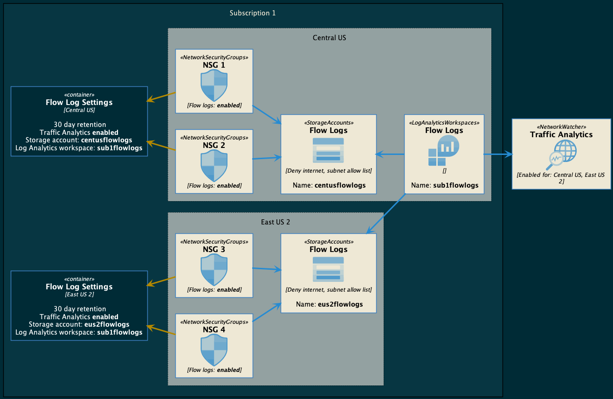

# Enterprise Pattern for Traffic Analytics

This is a sample design for enabling Traffic Analytics across subscriptions and regions for a typical enterprise Azure customer.



## Deploy Sample Environment

This repo incldues a sample network topology to help demonstrate how to enable Traffic Analytics to an existing environment with PowerShell. Use the following instructions to deploy this topology for testing.

In the `deployment` directory, create a new file called `sample.params.json` and place the following contents into the file:

```json
{
  "$schema": "https://schema.management.azure.com/schemas/2019-04-01/deploymentParameters.json#",
  "contentVersion": "1.0.0.0",
  "parameters": {
    "demoPrefix": { "value": "contoso" },
    "vmAdminUserName": { "value": "vmadmin" },
    "vmAdminPwd": { "value": "" },
    "tags": {
      "value": {
        "appId": "contoso",
        "costCenter": "abc123"
      }
    }
  }
}
```

Update the following values:

- `vmAdminPwd`: Set this to a random password

Run the following commands to deploy the core infrastructure:

```bash
az login
bicep build sample.bicep
az deployment sub create --name networkwatchersample --location centralus --template-file sample.json --parameters sample.params.json
```

## Enable Traffic Analytics

Navigate to the `scripts` director and run the following command to authenticate to Azure and connect to the target subscription:

```powershell
Connect-AzAccount
Set-AzContext -subscription "YOUR_SUBSCRIPTION_ID"
```

Next, run the script to enable flow logs for all NSGs in the subscription. Be sure to set the value of each parameter to match your environment.

```powershell
.\enable-nsgflows.ps1 -region "" -networkWatcherRG "" -storageAcctRG "" -storageAcctName "" -logWorkspaceRG "" -logWorkspaceName ""
```
